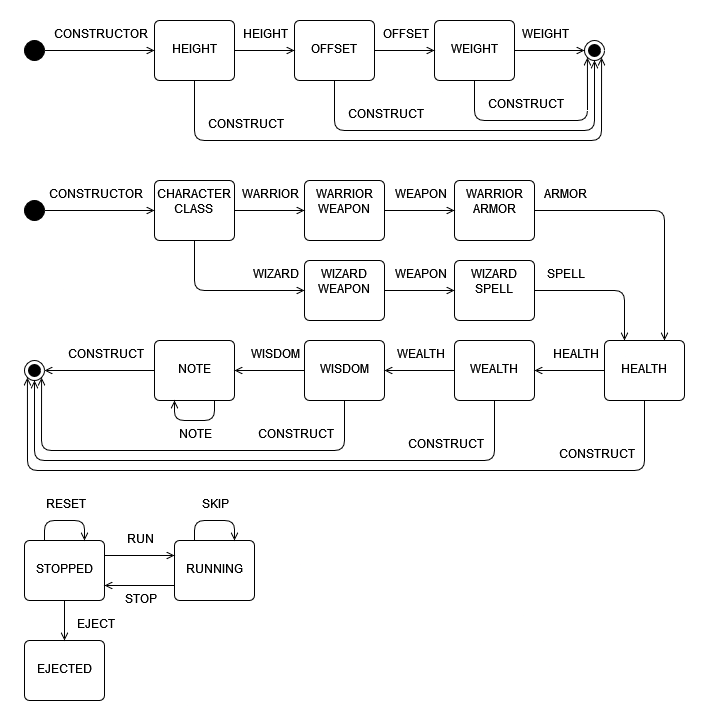

# Pattern Typestate

- Example Rust source code demonstrating the pattern "Typestate"

## Usage

- cd pattern-typestate/
- cargo run

## Fluent Constructor Examples

- Examples of using the typestate pattern to make a fluent constructor
- Techniques are gradually introduced from one example module to the next

- fluent_constructor_0
  - Demonstrates the basic typestate pattern as used with a fluent constructor
- fluent_constructor_1
  - Demonstrates specifying the state using a generic and phantom data
- fluent_constructor_2
  - Demonstrates a typestate fluent constructor for an external struct
- fluent_constructor_3
  - Demonstrates diverging and converging fluent constructor chain method paths

## State Machine Examples

- Examples of using the typestate pattern to make a state machine

- state_machine_0
  - Demonstrates a typestate state machine that operates on data inside itself
- state_machine_1
  - Demonstrates a typestate state machine that operates on data outside itself

## Links

- Slideshow Presentations
  - https://github.com/david-wallace-croft/pattern-typestate/tree/main/slides

## History

- Initial release: 2024-08-11
